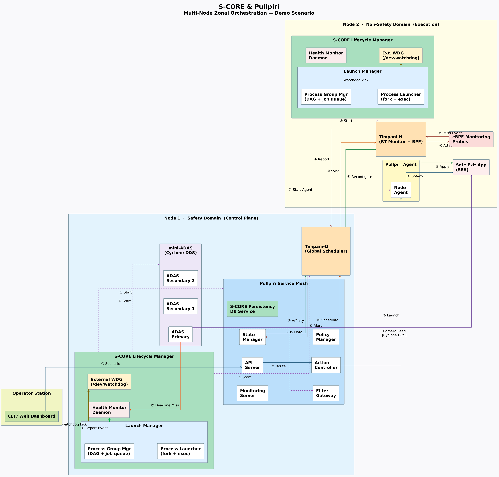

# s-core-poc

Integration PoC between S-CORE modules and Pullpiri/Timpani

## Overview
s-core-poc demonstrates integration between S-CORE modules and Pullpiri/Timpani systems across two nodes (Node-1: Safety Node, Node-2 : Non Safety)

---

## Architecture Diagram



The diagram shows the two-node architecture:
- **Node 1 (Safety/Control Plane)**: Pullpiri Service Mesh, Timpani-O, S-CORE Lifecycle Manager
- **Node 2 (Non-Safety/Execution)**: NodeAgent, Timpani-N, Container Workloads

---

## Getting Started

Clone the repository using one of the following methods:

**SSH:**
```sh
git clone git@github.com:MCO-PICCOLO/s-core-poc.git
```

**HTTPS:**
```sh
git clone https://github.com/MCO-PICCOLO/s-core-poc.git
```

After cloning, your directory structure will look like:

```
s-core-poc/
├── Node1/
│   ├── feo/
│   ├── lifecycle/
│   ├── pullpiri/
│   └── TIMPANI/
├── Node2/
│   ├── examples/
│   ├── lifecycle/
│   ├── pullpiri/
│   ├── sea_app/
│   └── TIMPANI/
├── README.md
└── ...
```

---

---

## Node1: Lifecycle Launch Manager

To build and run the S-CORE Lifecycle Launch Manager with Pullpiri components, follow the instructions in the Node1 run script:

- **[Node1 Setup Instructions →](Node1/README.md)**

This script will:
- Build the required S-CORE and Pullpiri binaries using Bazel and Cargo
- Sync necessary binaries to `/opt/pullpiri/bin`
- Start the Launch Manager daemon

See the linked README for detailed prerequisites and step-by-step instructions.

---

## Node2: Building and Setup of Node2

Node2 is responsible for building the Pullpiri `nodeagent` and `timpani-n` with Score Life cycle binary (note: the binary is around 100MB and cannot be uploaded to GitHub, so it must be built locally on Node2) and running the integration using its own run script.

- **[Node2 Setup Instructions →](Node2/README.md)**

For more details and system setup, see the Node2 README.

---

## Reference: Key File Locations

| File / Binary | Path |
|---|---|
| Launch Manager run script (Node1) | `Node1/lifecycle/lifecycle/examples/pullpiri_LM/run.sh` |
| Launch Manager run script (Node2) | `Node2/lifecycle/examples/pullpiri_LM/run.sh` |
| LM config (Node1) | `Node1/lifecycle/lifecycle/examples/pullpiri_LM/config/pullpiri_lm_config.json` |
| LM config (Node2) | `Node2/lifecycle/examples/pullpiri_LM/config/pullpiri_lm_config.json` |
| Workload apply script | `Node2/examples/timpani.sh` |
| Workload manifest (timpani) | `Node1/pullpiri/examples/resources/timpani-test.yaml` |
| sea-app manifest | `Node2/examples/resources/safe-exit-assist.yaml` |
| Node configuration (timpani-o) | `Node1/pullpiri/examples/resources/timpani/node_configurations.yaml` |
| NodeAgent config | `/etc/piccolo/nodeagent.yaml` (Node2) |
| Piccolo settings | `/etc/piccolo/settings.yaml` (Node1) |
| Stress tool | `Node2/TIMPANI/timpani-n/tools/stress_app_cpus.sh` |
| adas_primary `.so` libs | `Node1/feo/examples/rust/mini-adas/lib/` |
| All Pullpiri binaries | `/opt/pullpiri/bin/` (Both nodes) |
| Shared `.so` (runtime) | `/opt/pullpiri/lib/` (Both nodes) |

---

## Additional Notes

- Ensure all prerequisites (Bazel, Rust, Java, sudo access) are met as described in the respective READMEs.
- For troubleshooting and advanced configuration, refer to the documentation in each module's directory.
- To add the architecture diagram: Place your architecture PNG image at `.github/architecture.png`
